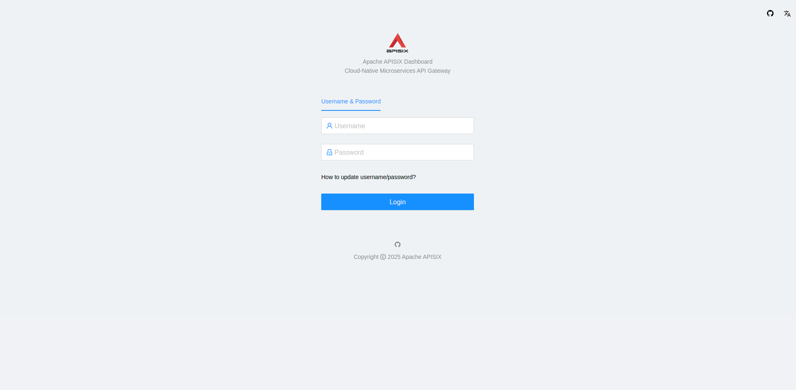
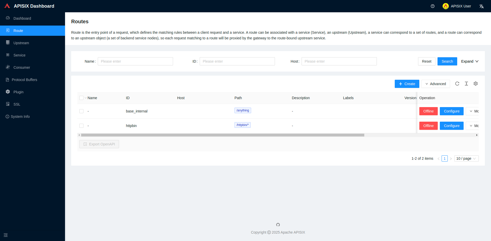

# APISIX Dashboard

TODO


## Setup

Start APISIX in Docker by running the following command:

```bash
docker compose up
```

Run the following script to create some simple test resources (Upstreams, Consumers, Routes):

```bash
./create_resources.sh
```

## Dashboard

The APISIX Dashboard is accessible at [http://localhost:9000](http://localhost:9000).



### Login

Admin credentials:

- username: `admin`
- password: `admin`

User credentials:

- username: `user`
- password: `password`

### User Guide

The user guide is available on APISIX official documentation: [APISIX Dashboard | User Guide](https://apisix.apache.org/docs/dashboard/USER_GUIDE/).


